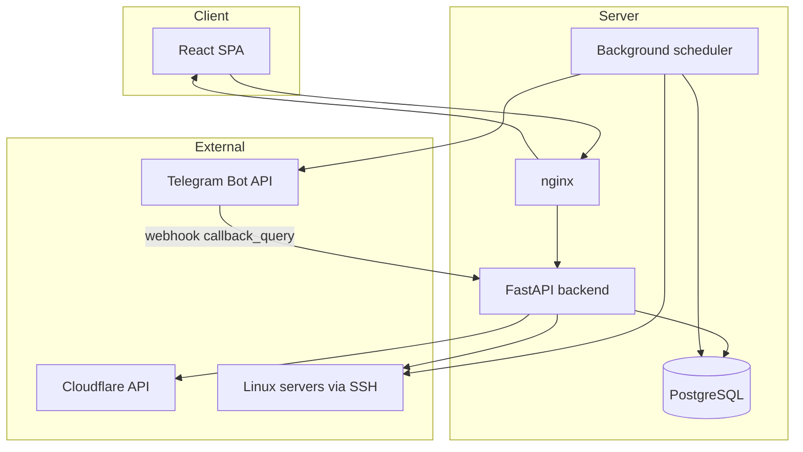

# SSH Control Panel

**Production-ready web panel for managing Linux server fleets over SSH.**

Centralized inventory, interactive terminal, bulk operations, PM2, billing reminders, Cloudflare DNS, Telegram alerts, RBAC, audit log, and backup — in one interface.

Repository: [Quadart21/ssh-agent-panel](https://github.com/Quadart21/ssh-agent-panel)

---

## Contents

- [Features](#features)
- [Architecture](#architecture)
- [Tech stack](#tech-stack)
- [Project structure](#project-structure)
- [Quick start (development)](#quick-start-development)
- [Production deployment](#production-deployment)
- [Environment variables](#environment-variables)
- [Telegram & payment reminders](#telegram--payment-reminders)
- [Permissions (RBAC)](#permissions-rbac)
- [API overview](#api-overview)
- [Updating production](#updating-production)

---

## Features

### Overview

| Section | Description |
|---------|-------------|
| **Dashboard** | Fleet summary, online/offline status, quick metrics |
| **Alerts** | SSH offline servers, payment warnings (dashboard view) |

### Infrastructure

| Section | Description |
|---------|-------------|
| **Servers** | Inventory with groups, filters, cards, bulk import, accounting tab |
| **Groups** | Organize servers by project, region, or role |
| **Domains** | Cloudflare DNS zones and records from the panel |
| **Linux users** | Create and manage users on remote servers |

### Operations

| Section | Description |
|---------|-------------|
| **Commands** | Run command patterns on one server, a group, or the whole fleet |
| **Automation** | Multi-step presets with live WebSocket progress |
| **Terminal** | Interactive SSH session in the browser (xterm.js) |
| **PM2** | List, start, stop, restart, delete apps; view logs; cluster support |
| **Patterns** | Reusable command templates |

### Security

| Section | Description |
|---------|-------------|
| **Firewall** | UFW status and rules on remote hosts |
| **Security** | SSH / fail2ban reports |
| **Sessions** | Active panel sessions, revoke access |
| **2FA** | TOTP with recovery codes |
| **Telegram** | Notifications, scheduler, webhook for inline buttons |

### Administration

| Section | Description |
|---------|-------------|
| **Panel users** | RBAC: sections, actions, server/group scope |
| **System** | Backup export/import, maintenance |
| **Audit** | Full action log with export |

### Server agent (optional)

Lightweight agent for CPU/RAM/disk metrics and remote task execution. Installed from the panel on Linux hosts.

### Billing & payments

Per-server fields: `pay_until`, `provider`, `monthly_cost`, `currency`, `billing_period`.

Automated Telegram workflow:

1. **7 days** before expiry — first reminder  
2. **3 days** before expiry — second reminder  
3. **Overdue** — daily reminders for **3 days**  
4. After 3 overdue days — server **auto-deleted** from the panel  

Each payment message includes server count, provider, amount, and a **«Оплатил»** button.  
Click → choose extension (30 / 90 / 180 / 365 days) → `pay_until` updated in the panel.

---

## Architecture



---

## Tech stack

| Layer | Stack |
|-------|-------|
| **Backend** | Python 3.11+, FastAPI, SQLAlchemy 2, Alembic, Paramiko |
| **Frontend** | React 18, TypeScript, Vite, React Router, xterm.js |
| **Database** | PostgreSQL (primary) |
| **Auth** | JWT + session tracking, bcrypt, TOTP 2FA |
| **Secrets** | Fernet encryption for stored SSH passwords |
| **Deploy** | systemd + nginx + certbot |

---

## Project structure

```text
SSH_client_GUI/
├── backend/
│   ├── app/
│   │   ├── routers/        # API endpoints
│   │   ├── services/       # SSH, alerts, telegram, cloudflare, backup…
│   │   ├── models.py       # SQLAlchemy models
│   │   └── main.py
│   └── migrations/         # Alembic revisions (0001–0009)
├── frontend/
│   └── src/
│       ├── components/     # Pages and UI blocks
│       ├── navigation/     # Sidebar, RBAC sections
│       └── api.ts          # REST client
└── deploy/
    ├── env/                # Production .env templates
    ├── nginx/
    └── systemd/
```

---

## Quick start (development)

### Requirements

- Python 3.11+
- Node.js 20+
- PostgreSQL 14+

### Backend

```bash
cd backend
python -m venv .venv
source .venv/bin/activate          # Windows: .venv\Scripts\activate
pip install -r requirements.txt
cp .env.example .env               # edit DATABASE_URL, SECRET_KEY, ADMIN_*
uvicorn app.main:app --reload --host 0.0.0.0 --port 8000
```

On startup the backend:

- runs Alembic migrations automatically;
- creates the first admin from `ADMIN_EMAIL` / `ADMIN_PASSWORD`.

### Frontend

```bash
cd frontend
npm install
cp .env.example .env
npm run dev
```

Open `http://localhost:5173`. API defaults to the same origin behind a reverse proxy.

### Dev on Windows

```powershell
.\run_dev.ps1
```

---

## Production deployment

Suggested path on the server: `/opt/gui-ssh-manager`

Detailed templates: [deploy/README.md](./deploy/README.md)

### 1. PostgreSQL

```bash
sudo -u postgres psql
CREATE USER ssh_panel WITH PASSWORD 'replace_me';
CREATE DATABASE ssh_panel OWNER ssh_panel;
\q
```

### 2. Application

```bash
git clone https://github.com/Quadart21/ssh-agent-panel.git /opt/gui-ssh-manager
cd /opt/gui-ssh-manager/backend
python3 -m venv .venv
source .venv/bin/activate
pip install -r requirements.txt
cp ../deploy/env/backend.production.env .env   # edit all secrets

cd ../frontend
npm install
cp ../deploy/env/frontend.production.env .env
npm run build
```

### 3. systemd

```bash
sudo cp /opt/gui-ssh-manager/deploy/systemd/gui-ssh-manager.service /etc/systemd/system/
sudo systemctl daemon-reload
sudo systemctl enable --now gui-ssh-manager
```

### 4. nginx + SSL

```bash
sudo cp /opt/gui-ssh-manager/deploy/nginx/ssh.norenvpn.com.conf /etc/nginx/sites-available/gui-ssh-manager
sudo ln -sf /etc/nginx/sites-available/gui-ssh-manager /etc/nginx/sites-enabled/
sudo nginx -t && sudo systemctl reload nginx
sudo certbot --nginx -d your-domain.example
```

---

## Environment variables

### Backend (required)

| Variable | Description |
|----------|-------------|
| `DATABASE_URL` | PostgreSQL connection string |
| `SECRET_KEY` | JWT signing key (replace before production) |
| `ADMIN_EMAIL` | Bootstrap admin login |
| `ADMIN_PASSWORD` | Bootstrap admin password |
| `FRONTEND_ORIGIN` | Public panel URL, e.g. `https://panel.example.com` |
| `ALLOWED_HOSTS` | Comma-separated hostnames for TrustedHost middleware |

### Backend (optional)

| Variable | Default | Description |
|----------|---------|-------------|
| `ENCRYPTION_KEY` | derived from `SECRET_KEY` | Fernet key for stored passwords |
| `TELEGRAM_BOT_TOKEN` | — | Bot token from @BotFather |
| `TELEGRAM_CHAT_ID` | — | Target chat / supergroup |
| `TELEGRAM_WEBHOOK_SECRET` | — | `secret_token` for webhook validation |
| `CLOUDFLARE_API_TOKEN` | — | DNS management |
| `CLOUDFLARE_ACCOUNT_ID` | — | Cloudflare account |
| `SCHEDULER_ENABLED` | `true` | Background alert & payment scheduler |
| `SCHEDULER_INTERVAL_SECONDS` | `300` | Scheduler tick interval |
| `ALERT_REPEAT_MINUTES` | `180` | Repeat interval for offline alerts |
| `ACCESS_TOKEN_EXPIRE_MINUTES` | `720` | JWT lifetime |
| `LOGIN_MAX_ATTEMPTS` | `5` | Brute-force protection |
| `SESSION_INACTIVITY_MINUTES` | `720` | Auto logout |

### Frontend

| Variable | Description |
|----------|-------------|
| `VITE_API_BASE_URL` | REST API base, e.g. `https://panel.example.com/api/v1` |
| `VITE_TERMINAL_WS_BASE_URL` | WebSocket URL for SSH terminal |

If omitted, the frontend uses the current browser origin (works behind nginx reverse proxy).

---

## Telegram & payment reminders

### Setup

1. Create a bot via [@BotFather](https://t.me/BotFather), get **token** and **chat id**.
2. Add to backend `.env`:

```env
TELEGRAM_BOT_TOKEN=123456:ABC...
TELEGRAM_CHAT_ID=-1001234567890
TELEGRAM_WEBHOOK_SECRET=your-random-secret
FRONTEND_ORIGIN=https://panel.example.com
```

3. Restart backend, open **Telegram** section in the panel.
4. Click **«Зарегистрировать webhook»** (or register manually):

```bash
curl -X POST "https://api.telegram.org/bot<TOKEN>/setWebhook" \
  -H "Content-Type: application/json" \
  -d '{
    "url": "https://panel.example.com/api/v1/notifications/telegram/incoming",
    "secret_token": "your-random-secret",
    "allowed_updates": ["callback_query"]
  }'
```

**PowerShell:**

```powershell
$body = @{
  url = "https://panel.example.com/api/v1/notifications/telegram/incoming"
  secret_token = "your-random-secret"
  allowed_updates = @("callback_query")
} | ConvertTo-Json

Invoke-RestMethod -Method Post `
  -Uri "https://api.telegram.org/bot<TOKEN>/setWebhook" `
  -ContentType "application/json" `
  -Body $body
```

### Notification types

| Event | Telegram topic setting |
|-------|------------------------|
| Login | `telegram_topic_login` |
| Server offline | `telegram_topic_servers` |
| Payment reminders | `telegram_topic_payments` |
| Automation errors | `telegram_topic_automation` |

Topics map to Telegram forum `message_thread_id` (optional).

### Server billing fields

Fill on each server (Servers → edit / accounting):

- **pay_until** — payment deadline  
- **provider** — e.g. Hetzner, ServHost  
- **monthly_cost** + **currency** + **billing_period**

---

## Permissions (RBAC)

Panel users can be restricted by:

- **Sections** — which pages are visible (servers, terminal, domains…)
- **Actions** — create/update/delete servers, run commands, manage domains…
- **Scope** — all servers, specific groups, or individual servers

Admin users have full access including panel users, audit, and system backup.

---

## API overview

Base path: `/api/v1`

| Area | Examples |
|------|----------|
| **Auth** | `POST /auth/login`, `GET /auth/me`, `GET /auth/sessions` |
| **Servers** | `GET /servers`, `POST /servers`, `POST /servers/run-commands` |
| **Terminal** | `WS /terminal/ws/{server_id}` |
| **Automation** | `GET /automation/presets`, `WS /automation/ws/run` |
| **PM2** | `GET /pm2/{server_id}/apps`, `POST …/restart` |
| **Domains** | `GET /domains/zones`, `POST /domains/records` |
| **Notifications** | `GET /notifications/settings`, `POST /notifications/telegram/webhook/set` |
| **Audit** | `GET /audit/logs` |
| **Health** | `GET /health` |

Interactive docs (when enabled): `/docs`

---

## Updating production

Standard update on the server:

```bash
cd /opt/gui-ssh-manager && git pull \
  && cd backend && pip install -r requirements.txt \
  && cd ../frontend && npm install && npm run build \
  && sudo systemctl restart gui-ssh-manager \
  && sudo systemctl reload nginx
```

Migrations run automatically on backend startup.

---

## Security notes

- Replace `SECRET_KEY`, admin password, and database credentials before going live.
- Use HTTPS everywhere; terminal WebSocket requires `wss://`.
- Restrict panel access by IP in nginx if needed.
- Revoke Telegram bot token if it was exposed; regenerate via @BotFather.
- Stored SSH passwords are encrypted; prefer SSH keys where possible.

---

## License

Private / internal use. Adjust licensing as needed for your organization.
