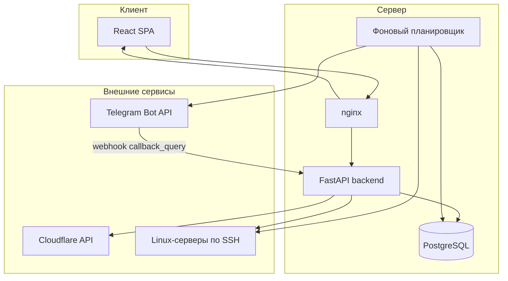

# SSH Control Panel

**Production-ready веб-панель для управления парком Linux-серверов по SSH.**

Единый интерфейс: инвентарь, терминал, массовые команды, PM2, напоминания об оплате, Cloudflare DNS, Telegram-алерты, RBAC, аудит и бэкапы.

Репозиторий: [Quadart21/ssh-agent-panel](https://github.com/Quadart21/ssh-agent-panel)

---

## Содержание

- [Возможности](#возможности)
- [Архитектура](#архитектура)
- [Стек технологий](#стек-технологий)
- [Структура проекта](#структура-проекта)
- [Быстрый старт (разработка)](#быстрый-старт-разработка)
- [Production-деплой](#production-деплой)
- [Переменные окружения](#переменные-окружения)
- [Telegram и напоминания об оплате](#telegram-и-напоминания-об-оплате)
- [Права доступа (RBAC)](#права-доступа-rbac)
- [Обзор API](#обзор-api)
- [Обновление на сервере](#обновление-на-сервере)

---

## Возможности

### Обзор

| Раздел | Описание |
|--------|----------|
| **Дашборд** | Сводка по парку, онлайн/офлайн, быстрые метрики |
| **Уведомления** | Алерты: офлайн-серверы, предупреждения об оплате |

### Инфраструктура

| Раздел | Описание |
|--------|----------|
| **Серверы** | Инвентарь: группы, фильтры, карточки, массовый импорт, бухгалтерия |
| **Группы** | Организация серверов по проектам, регионам, ролям |
| **Домены** | Управление DNS-зонами и записями Cloudflare |
| **Linux-пользователи** | Создание и управление пользователями на удалённых хостах |

### Операции

| Раздел | Описание |
|--------|----------|
| **Команды** | Массовый запуск шаблонов на одном сервере, группе или всём парке |
| **Автоматизация** | Многошаговые сценарии с live-прогрессом по WebSocket |
| **Терминал** | Интерактивная SSH-сессия в браузере (xterm.js) |
| **PM2** | Список, старт, стоп, рестарт, удаление; логи; cluster-режим |
| **Шаблоны** | Переиспользуемые наборы команд |

### Безопасность

| Раздел | Описание |
|--------|----------|
| **Firewall** | Статус UFW и правила на удалённых хостах |
| **Безопасность** | Отчёты SSH / fail2ban |
| **Сессии** | Активные сессии панели, отзыв доступа |
| **2FA** | TOTP с recovery-кодами |
| **Telegram** | Уведомления, планировщик, webhook для inline-кнопок |

### Администрирование

| Раздел | Описание |
|--------|----------|
| **Доступ** | RBAC: разделы, действия, scope по серверам/группам |
| **Система** | Экспорт/импорт бэкапа, обслуживание |
| **Аудит** | Журнал всех действий с экспортом |

### Агент на сервере (опционально)

Лёгкий агент для метрик CPU/RAM/Disk и удалённых задач. Устанавливается из панели на Linux-хостах.

### Бухгалтерия и оплата

Поля на каждом сервере: `pay_until`, `provider`, `monthly_cost`, `currency`, `billing_period`.

Автоматический сценарий в Telegram:

1. **За 7 дней** до истечения — первое напоминание  
2. **За 3 дня** — второе напоминание  
3. **Просрочка** — ежедневные уведомления **3 дня**  
4. После 3 дней просрочки — сервер **автоматически удаляется** из панели  

В каждом сообщении: количество серверов, провайдер, сумма, список хостов.  
Под сообщением кнопка **«Оплатил»** → выбор срока (30 / 90 / 180 / 365 дней) → `pay_until` обновляется в панели.

---

## Архитектура



---

## Стек технологий

| Слой | Технологии |
|------|------------|
| **Backend** | Python 3.11+, FastAPI, SQLAlchemy 2, Alembic, Paramiko |
| **Frontend** | React 18, TypeScript, Vite, React Router, xterm.js |
| **База данных** | PostgreSQL |
| **Аутентификация** | JWT + учёт сессий, bcrypt, TOTP 2FA |
| **Секреты** | Fernet-шифрование паролей SSH |
| **Деплой** | systemd + nginx + certbot |

---

## Структура проекта

```text
SSH_client_GUI/
├── backend/
│   ├── app/
│   │   ├── routers/        # API-эндпоинты
│   │   ├── services/       # SSH, алерты, telegram, cloudflare, backup…
│   │   ├── models.py       # SQLAlchemy-модели
│   │   └── main.py
│   └── migrations/         # Alembic-миграции (0001–0009)
├── frontend/
│   └── src/
│       ├── components/     # Страницы и UI-блоки
│       ├── navigation/     # Сайдбар, RBAC-секции
│       └── api.ts          # REST-клиент
└── deploy/
    ├── env/                # Production .env-шаблоны
    ├── nginx/
    └── systemd/
```

---

## Быстрый старт (разработка)

### Требования

- Python 3.11+
- Node.js 20+
- PostgreSQL 14+

### Backend

```bash
cd backend
python -m venv .venv
source .venv/bin/activate          # Windows: .venv\Scripts\activate
pip install -r requirements.txt
cp .env.example .env               # отредактируй DATABASE_URL, SECRET_KEY, ADMIN_*
uvicorn app.main:app --reload --host 0.0.0.0 --port 8000
```

При старте backend автоматически:

- применяет Alembic-миграции;
- создаёт первого админа из `ADMIN_EMAIL` / `ADMIN_PASSWORD`.

### Frontend

```bash
cd frontend
npm install
cp .env.example .env
npm run dev
```

Открой `http://localhost:5173`. API по умолчанию берёт origin браузера (удобно за reverse proxy).

### Dev на Windows

```powershell
.\run_dev.ps1
```

---

## Production-деплой

Рекомендуемый путь на сервере: `/opt/gui-ssh-manager`

Подробные шаблоны: [deploy/README.md](./deploy/README.md)

### 1. PostgreSQL

```bash
sudo -u postgres psql
CREATE USER ssh_panel WITH PASSWORD 'replace_me';
CREATE DATABASE ssh_panel OWNER ssh_panel;
\q
```

### 2. Приложение

```bash
git clone https://github.com/Quadart21/ssh-agent-panel.git /opt/gui-ssh-manager
cd /opt/gui-ssh-manager/backend
python3 -m venv .venv
source .venv/bin/activate
pip install -r requirements.txt
cp ../deploy/env/backend.production.env .env   # замени все секреты

cd ../frontend
npm install
cp ../deploy/env/frontend.production.env .env
npm run build
```

### 3. systemd

```bash
sudo cp /opt/gui-ssh-manager/deploy/systemd/gui-ssh-manager.service /etc/systemd/system/
sudo systemctl daemon-reload
sudo systemctl enable --now gui-ssh-manager
```

### 4. nginx + SSL

```bash
sudo cp /opt/gui-ssh-manager/deploy/nginx/ssh.norenvpn.com.conf /etc/nginx/sites-available/gui-ssh-manager
sudo ln -sf /etc/nginx/sites-available/gui-ssh-manager /etc/nginx/sites-enabled/
sudo nginx -t && sudo systemctl reload nginx
sudo certbot --nginx -d your-domain.example
```

---

## Переменные окружения

### Backend (обязательные)

| Переменная | Описание |
|------------|----------|
| `DATABASE_URL` | Строка подключения к PostgreSQL |
| `SECRET_KEY` | Ключ подписи JWT (замени перед production) |
| `ADMIN_EMAIL` | Email bootstrap-админа |
| `ADMIN_PASSWORD` | Пароль bootstrap-админа |
| `FRONTEND_ORIGIN` | Публичный URL панели, напр. `https://panel.example.com` |
| `ALLOWED_HOSTS` | Hostname через запятую для TrustedHost middleware |

### Backend (опциональные)

| Переменная | По умолчанию | Описание |
|------------|--------------|----------|
| `ENCRYPTION_KEY` | из `SECRET_KEY` | Fernet-ключ для паролей SSH |
| `TELEGRAM_BOT_TOKEN` | — | Токен бота от @BotFather |
| `TELEGRAM_CHAT_ID` | — | Chat / supergroup ID |
| `TELEGRAM_WEBHOOK_SECRET` | — | `secret_token` для проверки webhook |
| `CLOUDFLARE_API_TOKEN` | — | Управление DNS |
| `CLOUDFLARE_ACCOUNT_ID` | — | ID аккаунта Cloudflare |
| `SCHEDULER_ENABLED` | `true` | Фоновый планировщик алертов и оплат |
| `SCHEDULER_INTERVAL_SECONDS` | `300` | Интервал проверки |
| `ALERT_REPEAT_MINUTES` | `180` | Повтор офлайн-алертов |
| `ACCESS_TOKEN_EXPIRE_MINUTES` | `720` | Время жизни JWT |
| `LOGIN_MAX_ATTEMPTS` | `5` | Защита от брутфорса |
| `SESSION_INACTIVITY_MINUTES` | `720` | Автовыход по неактивности |

### Frontend

| Переменная | Описание |
|------------|----------|
| `VITE_API_BASE_URL` | База REST API, напр. `https://panel.example.com/api/v1` |
| `VITE_TERMINAL_WS_BASE_URL` | WebSocket URL для SSH-терминала |

Если не заданы — frontend использует текущий origin браузера (работает за nginx reverse proxy).

---

## Telegram и напоминания об оплате

### Настройка

1. Создай бота через [@BotFather](https://t.me/BotFather), получи **токен** и **chat id**.
2. Добавь в `.env` backend:

```env
TELEGRAM_BOT_TOKEN=123456:ABC...
TELEGRAM_CHAT_ID=-1001234567890
TELEGRAM_WEBHOOK_SECRET=случайная-строка
FRONTEND_ORIGIN=https://panel.example.com
```

3. Перезапусти backend, открой раздел **Telegram** в панели.
4. Нажми **«Зарегистрировать webhook»** (или вручную):

```bash
curl -X POST "https://api.telegram.org/bot<TOKEN>/setWebhook" \
  -H "Content-Type: application/json" \
  -d '{
    "url": "https://panel.example.com/api/v1/notifications/telegram/incoming",
    "secret_token": "случайная-строка",
    "allowed_updates": ["callback_query"]
  }'
```

**PowerShell:**

```powershell
$body = @{
  url = "https://panel.example.com/api/v1/notifications/telegram/incoming"
  secret_token = "случайная-строка"
  allowed_updates = @("callback_query")
} | ConvertTo-Json

Invoke-RestMethod -Method Post `
  -Uri "https://api.telegram.org/bot<TOKEN>/setWebhook" `
  -ContentType "application/json" `
  -Body $body
```

> В PowerShell используй **`/bot`**, не `/b` в URL.  
> Для кнопки «Оплатил» достаточно `"callback_query"`.

### Типы уведомлений

| Событие | Настройка топика |
|---------|------------------|
| Вход в панель | `telegram_topic_login` |
| Офлайн-сервер | `telegram_topic_servers` |
| Напоминания об оплате | `telegram_topic_payments` |
| Ошибки автоматизации | `telegram_topic_automation` |

Топики соответствуют `message_thread_id` в Telegram-форуме (опционально).

### Поля оплаты на сервере

Заполни в карточке сервера (Серверы → редактирование / бухгалтерия):

- **pay_until** — дата оплаты  
- **provider** — провайдер (Hetzner, ServHost и т.д.)  
- **monthly_cost** + **currency** + **billing_period**

---

## Права доступа (RBAC)

Пользователи панели ограничиваются по:

- **Разделам** — какие страницы видны (серверы, терминал, домены…)  
- **Действиям** — создание/редактирование/удаление серверов, запуск команд, управление DNS…  
- **Scope** — все серверы, конкретные группы или отдельные хосты  

Администраторы имеют полный доступ, включая пользователей панели, аудит и системный бэкап.

---

## Обзор API

Базовый путь: `/api/v1`

| Область | Примеры |
|---------|---------|
| **Auth** | `POST /auth/login`, `GET /auth/me`, `GET /auth/sessions` |
| **Серверы** | `GET /servers`, `POST /servers`, `POST /servers/run-commands` |
| **Терминал** | `WS /terminal/ws/{server_id}` |
| **Автоматизация** | `GET /automation/presets`, `WS /automation/ws/run` |
| **PM2** | `GET /pm2/{server_id}/apps`, `POST …/restart` |
| **Домены** | `GET /domains/zones`, `POST /domains/records` |
| **Уведомления** | `GET /notifications/settings`, `POST /notifications/telegram/webhook/set` |
| **Аудит** | `GET /audit/logs` |
| **Health** | `GET /health` |

Интерактивная документация (если включена): `/docs`

---

## Обновление на сервере

Стандартная команда:

```bash
cd /opt/gui-ssh-manager && git pull \
  && cd backend && pip install -r requirements.txt \
  && cd ../frontend && npm install && npm run build \
  && sudo systemctl restart gui-ssh-manager \
  && sudo systemctl reload nginx
```

Миграции применяются автоматически при старте backend.

---

## Безопасность

- Замени `SECRET_KEY`, пароль админа и credentials БД перед выходом в production.
- Используй HTTPS везде; терминал требует `wss://`.
- При необходимости ограничь доступ к панели по IP в nginx.
- Если токен Telegram попал в чат — перевыпусти через @BotFather (`/revoke`).
- Пароли SSH хранятся зашифрованными; по возможности используй SSH-ключи.

---

## Лицензия

Private / internal use. Настрой лицензию под свою организацию.
